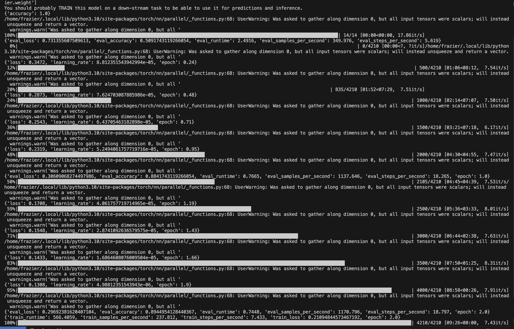
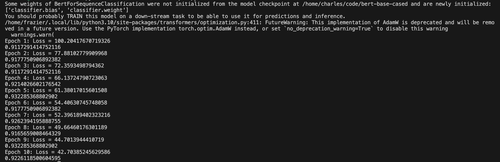

# Important-message-extraction

## 设计想法

> 每天QQ群都有成百上千条消息（尤其是‘抽象的群友‘以及“群复读机”的发言💬，经常把老师、导员🧑‍🏫重要的通知📢吞掉💢💢💢
> 万一错过了老师发布的考试时间等重要消息就寄了😢
> 还有，只有群主和管理员才能"@全体成员"，i人拒绝打搅群主和管理员👿

于逝......我希望能够创造一个分类器，自动帮我们区分何为“重要消息提醒⏰”，这样就能大大降低接、发消息人的成本😊

## 模型选取

本项目使用了 Huggingface🤗 的 Bert 预训练模型 bert-base-cased。在训练中，使用了 bert-base-cased 所提供的 model 和 tokenizer。

文本分类的算法非常多，有监督的、无监督的...拿脍炙人口的KNN算法举例，考虑到我们所需要的数据集必须要自己处理，同一些经典的数据集相比质量肯定不高，难免会出现一些噪声点、异常点，对数据预处理要求很高；并且考虑到最后可能会需要5次方量级的数据，KNN的计算复杂的会非常高。

可是如果我们追求性能，又恰巧有性能强大的计算资源（感谢南京大学智能科学与技术学院🙏）我自然毫不犹豫地选择———“预训练模型”！

在经典的数据集“glue_sst2”完成测试(test.py)并看到惊人的效果后:



更加坚定了使用**预训练模型**的想法💡。

## 数据选取与收集

训练数据我们使用了QQ群群友的聊天记录。

- 收集方式：QQ内置聊天记录导出功能。（建议电脑端💻操作，导出为txt格式）

## 数据处理

### 使用re库，对有效数据进行提取

- 原始导出数据📊⬇️

```
2023-09-20 9:47:43 AM XXX(xxxxxxxxxx)


2023-09-20 11:04:59 AM XXX(xxxxxxxxxx)
@全体成员 由于课程组划分，大家的团组织关系需要转接，请大家登录智慧团建，在左侧菜单栏选择关系接转，转入xxx团支部，截止时间为22日晚上8点【注意: 原xx的同学已自动转入，不需要再提交关系转接】

2023-09-20 11:05:53 AM XXX(xxxxxxxxxx)
请各位团员抽空余时间尽快完成团组织关系转接
```

- 使用（data_process.py）清洗后数据📊⬇️（默认打上“\t0”的标签🏷️）

```
	0
@全体成员 由于课程组划分，大家的团组织关系需要转接，请大家登录智慧团建，在左侧菜单栏选择关系接转，转入xxx团支部，截止时间为22日晚上8点【注意: 原xx的同学已自动转入，不需要再提交关系转接】  0
请各位团员抽空余时间尽快完成团组织关系转接  0
```

- 对如下情况进行清洗🧽（使数据量减少1/5-1/6！）：

  ```
  	0
  [表情]	0
  @全体成员	0
  [图片]	0
  //对上下文连续重复的信息只保留一个（群复读机）
  ```

- 使用人类对数据进行标注😭：如果是重要通知，就把0改成1

- 使用（data_to_json.py）将txt转化成json方便读取

## 调用模型进行训练🏋️ 并测试

train.py



## 看看在普通数据上的表现

涉及到数据隐私，不做展示
